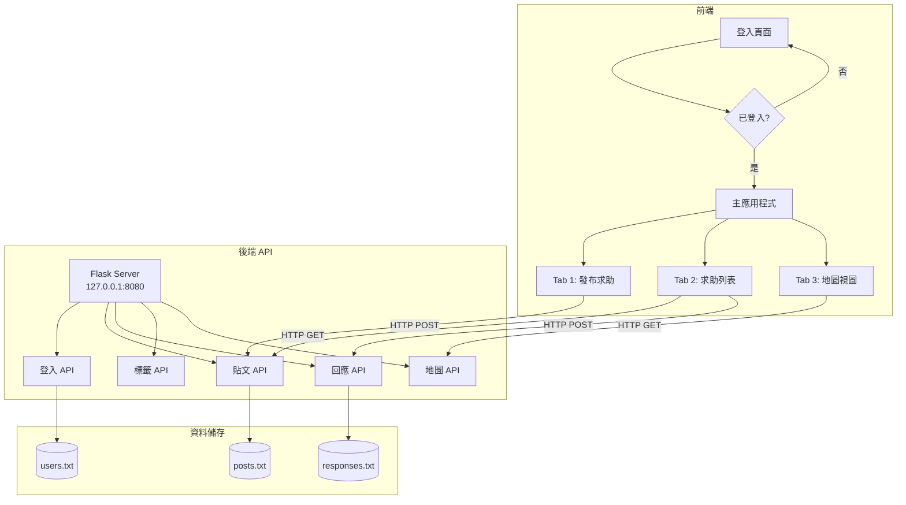
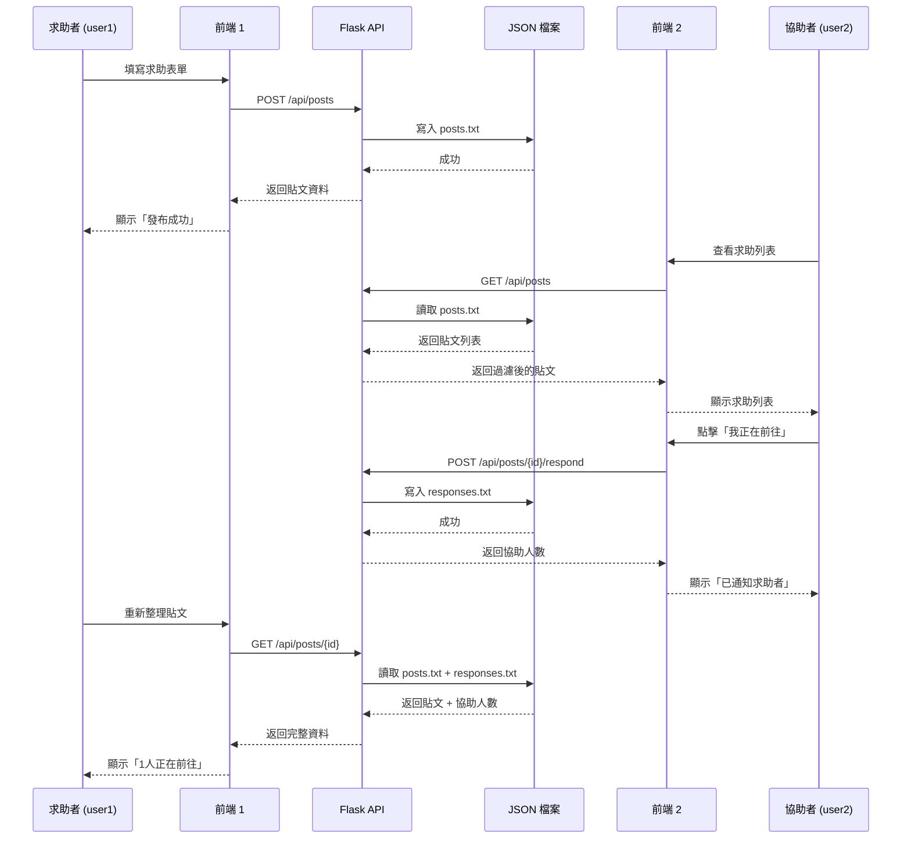
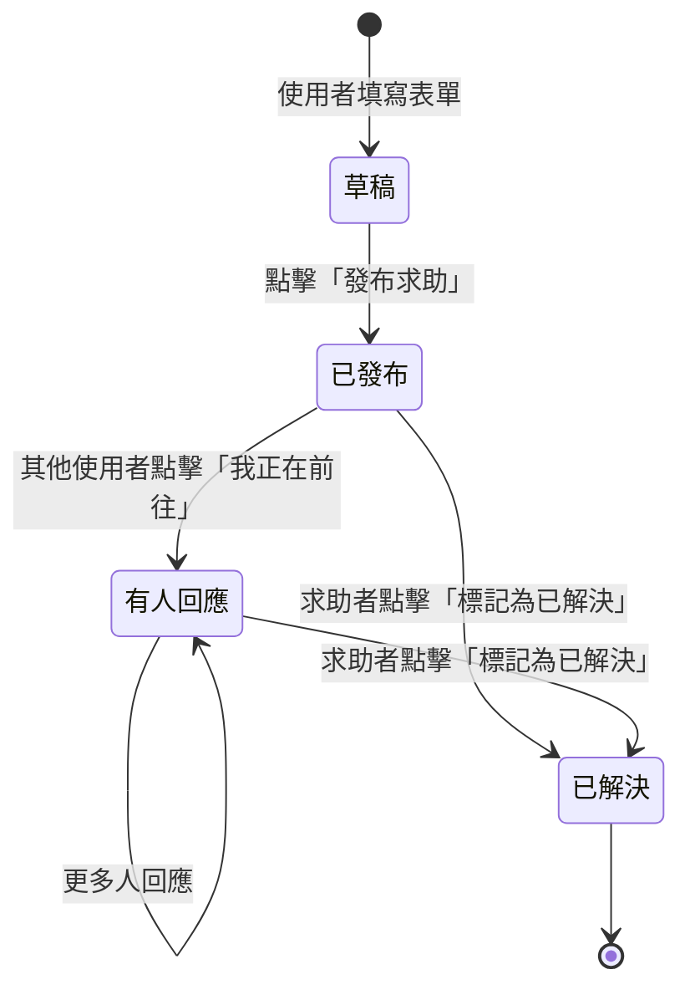
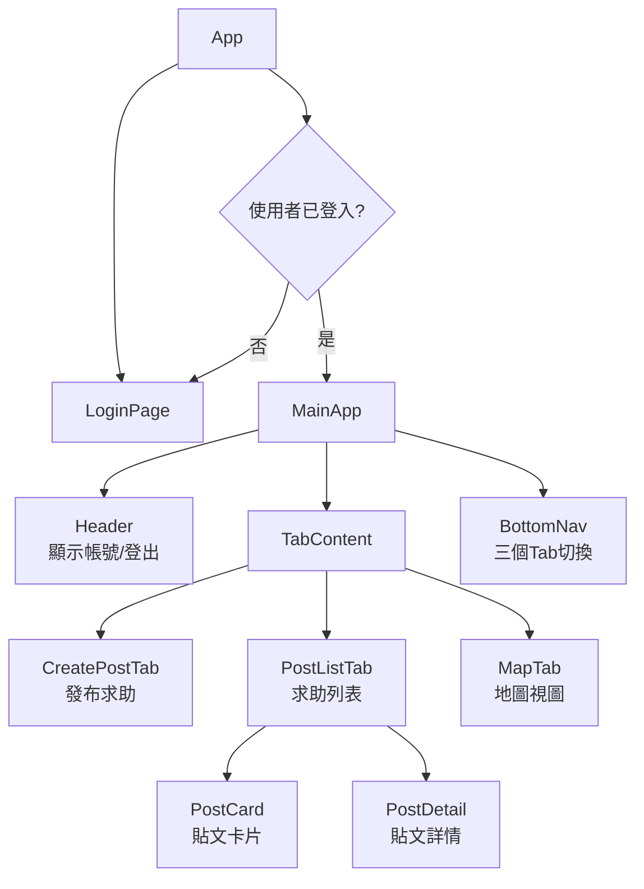
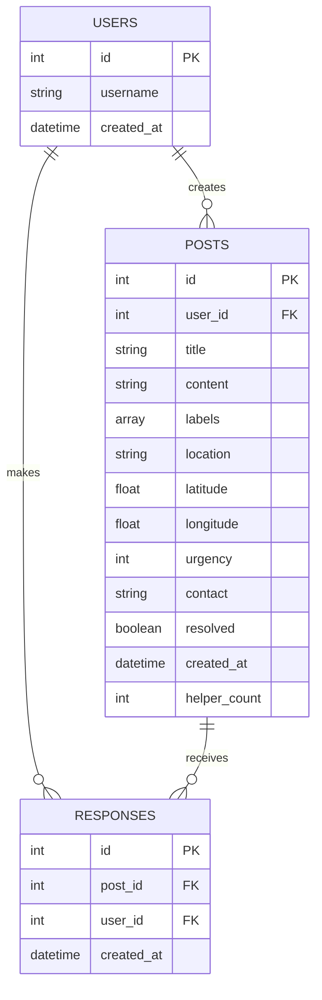
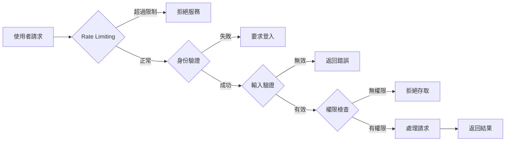

# 安全求助平台 - 系統架構圖

## 整體架構

```mermaid
graph TB
    subgraph 前端
        A[登入頁面] --> B{已登入?}
        B -->|是| C[主應用程式]
        B -->|否| A
        
        C --> D[Tab 1: 發布求助]
        C --> E[Tab 2: 求助列表]
        C --> F[Tab 3: 地圖視圖]
    end
    
    subgraph 後端 API
        G[Flask Server<br/>127.0.0.1:8080]
        G --> H[登入 API]
        G --> I[貼文 API]
        G --> J[回應 API]
        G --> K[標籤 API]
        G --> L[地圖 API]
    end
    
    subgraph 資料儲存
        M[(users.txt)]
        N[(posts.txt)]
        O[(responses.txt)]
    end
    
    D -->|HTTP POST| I
    E -->|HTTP GET| I
    E -->|HTTP POST| J
    F -->|HTTP GET| L
    
    I --> N
    J --> O
    H --> M
```

## 資料流程

```mermaid
sequenceDiagram
    participant U1 as 求助者 (user1)
    participant F1 as 前端 1
    participant API as Flask API
    participant DB as JSON 檔案
    participant F2 as 前端 2
    participant U2 as 協助者 (user2)
    
    U1->>F1: 填寫求助表單
    F1->>API: POST /api/posts
    API->>DB: 寫入 posts.txt
    DB-->>API: 成功
    API-->>F1: 返回貼文資料
    F1-->>U1: 顯示「發布成功」
    
    U2->>F2: 查看求助列表
    F2->>API: GET /api/posts
    API->>DB: 讀取 posts.txt
    DB-->>API: 返回貼文列表
    API-->>F2: 返回過濾後的貼文
    F2-->>U2: 顯示求助列表
    
    U2->>F2: 點擊「我正在前往」
    F2->>API: POST /api/posts/{id}/respond
    API->>DB: 寫入 responses.txt
    DB-->>API: 成功
    API-->>F2: 返回協助人數
    F2-->>U2: 顯示「已通知求助者」
    
    U1->>F1: 重新整理貼文
    F1->>API: GET /api/posts/{id}
    API->>DB: 讀取 posts.txt + responses.txt
    DB-->>API: 返回貼文 + 協助人數
    API-->>F1: 返回完整資料
    F1-->>U1: 顯示「1人正在前往」
```

## 貼文狀態流程

```mermaid
stateDiagram-v2
    [*] --> 草稿: 使用者填寫表單
    草稿 --> 已發布: 點擊「發布求助」
    已發布 --> 有人回應: 其他使用者點擊「我正在前往」
    有人回應 --> 有人回應: 更多人回應
    已發布 --> 已解決: 求助者點擊「標記為已解決」
    有人回應 --> 已解決: 求助者點擊「標記為已解決」
    已解決 --> [*]
```

## 前端組件結構

```mermaid
graph TD
    A[App] --> B[LoginPage]
    A --> C{使用者已登入?}
    C -->|是| D[MainApp]
    C -->|否| B
    
    D --> E[Header<br/>顯示帳號/登出]
    D --> F[TabContent]
    D --> G[BottomNav<br/>三個Tab切換]
    
    F --> H[CreatePostTab<br/>發布求助]
    F --> I[PostListTab<br/>求助列表]
    F --> J[MapTab<br/>地圖視圖]
    
    I --> K[PostCard<br/>貼文卡片]
    I --> L[PostDetail<br/>貼文詳情]
```

## 資料庫結構

```mermaid
erDiagram
    USERS {
        int id PK
        string username
        datetime created_at
    }
    
    POSTS {
        int id PK
        int user_id FK
        string title
        string content
        array labels
        string location
        float latitude
        float longitude
        int urgency
        string contact
        boolean resolved
        datetime created_at
        int helper_count
    }
    
    RESPONSES {
        int id PK
        int post_id FK
        int user_id FK
        datetime created_at
    }
    
    USERS ||--o{ POSTS : creates
    USERS ||--o{ RESPONSES : makes
    POSTS ||--o{ RESPONSES : receives
```

## 安全防護層 (待實作)

```mermaid
graph LR
    A[使用者請求] --> B{Rate Limiting}
    B -->|超過限制| C[拒絕服務]
    B -->|正常| D{身份驗證}
    D -->|失敗| E[要求登入]
    D -->|成功| F{輸入驗證}
    F -->|無效| G[返回錯誤]
    F -->|有效| H{權限檢查}
    H -->|無權限| I[拒絕存取]
    H -->|有權限| J[處理請求]
    J --> K[返回結果]
```

---

**說明:**
- 這些架構圖展示了系統的主要組件和它們之間的關係
- 實際運作時，所有互動都是即時的
- 資料流程確保求助者和協助者之間的即時溝通
